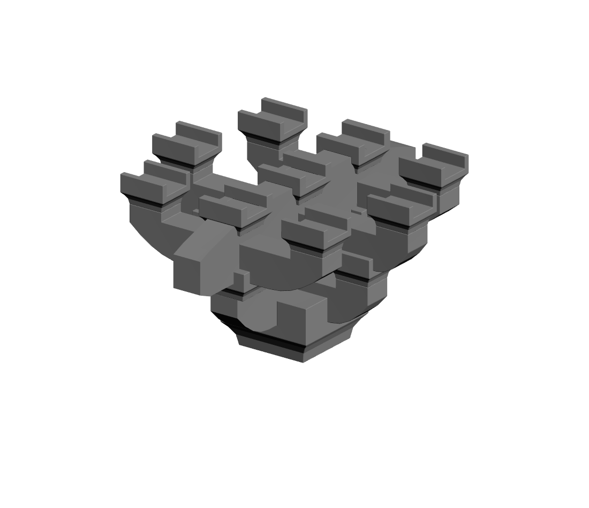

# YFS Golden 4P — 营造法式柱头斗栱

Houdini 工程：选择 **YFS_4P_EXT_COLUMNHEAD_STANDARD** 即生成完整柱头四铺作。



## 打开使用

1. 使用 Houdini 22.0（验证版本 22.0.368）打开 [工程](outputs/YFS_DG_GOLDEN_4P_v1.hip)。
2. 选择 `/obj/YFS_DG_RULE_SYSTEM`。默认 Recipe 为 Golden 4P，`Generate Full Golden 4P` 为 ON，`Show Debug Guides` 为 OFF。
3. Recipe 也可以在 `YFS_DG_ASSEMBLY` 内切换。插昂与 5P 不残留 Golden 实体。

项目附带现有 Atom Library 的 16 个 canonical USD 文件，未重新生成任何 Atom。打包工程使用 `$YFS_DG_ATOM_ROOT` 指向随附 `assets/atom_library`；可在顶层 Atom Library Root 改为自己的库。原始 Atom 的 Blender/FBX 编辑源不包含在此运行包中。

## 本阶段结果

| 项目 | 结果 |
|---|---|
| 完整实例 | 21 个 Packed 实例，12 类共享 Atom |
| 等效三角形 | 4380 |
| BBox X/Y/Z | 1.408 / 1.613333 / 0.850667 m |
| 承托面 | 54F = 0.792 m；58F 仅 BBox 顶高 |
| 固定件竖向状态 | EXACT_GOLDEN |
| TEST 1–5 | 全部 PASS |

未找到完整实例 Transform 表；使用原库的 source-object 映射、原装配基点，以及已有栱件端承托面的中心，建立仅作用于 Golden 4P 的项目模板。没有补造 5P–8P 层位，也没有重复 Atom topology 或历史资料 QA。

- [实施报告](outputs/YFS_DG_RULES/GOLDEN_4P_IMPLEMENTATION_REPORT.md)
- [QA 数据](outputs/YFS_DG_RULES/GOLDEN_4P_QA.json)
- [装配模板](outputs/YFS_DG_RULES/YFS_DG_GOLDEN_4P_ASSEMBLY_v1.json)
- [Packed Geometry 导出](outputs/generated/YFS_M_DG_4P_COLUMNHEAD_GOLDEN.bgeo.sc)

## 项目结构

```text
outputs/                 当前 HIP、HDA、规则、QA、预览及导出
assets/atom_library/     现有 USD 原子与来源 metadata（原样复制）
baseline/                上一阶段工程/HDA/规则，供增量构建
tools/                   构建、最小验收、整理和预览脚本
```

HDA 定义已嵌入 HIP；独立 HDA 同时包含 Golden Assembler 1.0 和 Vertical Solver 1.1。原有 Branch/Jump/Assembly 与 ANG 定义保持原版本。

## 复现

在项目根目录使用 Houdini 自带 `hython` 运行：

```text
hython tools/build_golden.py
hython tools/test_golden.py
hython tools/finalize_golden.py
```

Windows 若 USD DLL 导入失败，将当前进程 `PXR_USD_WINDOWS_DLL_PATH` 设为 Houdini 安装目录下的 `bin`。预览可用 `hython tools/render_golden.py` 生成；不属于新增几何 QA。

输出：`OUT_GOLDEN_4P_FULL`、`OUT_SEMANTIC_REQUESTS`、`OUT_UNRESOLVED`、`OUT_DEBUG`，另有 `OUT_GOLDEN_4P_CONNECTORS`。`VIEWPORT_OUTPUT` 根据 Recipe 和 Debug 开关自动选择主显示。

下一步：在 Golden 4P 稳定基础上，把 **assembly template + vertical layer** 机制推广至 5P。
